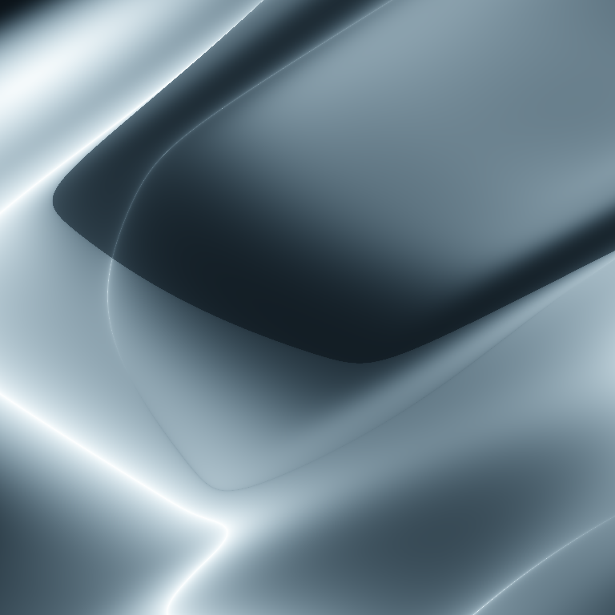
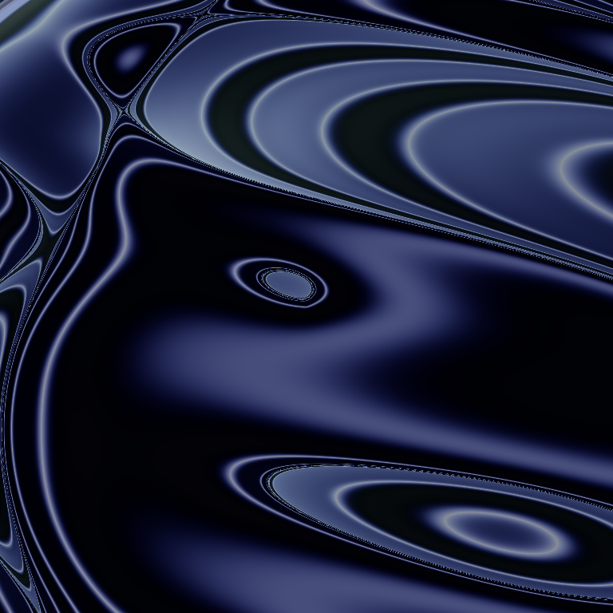
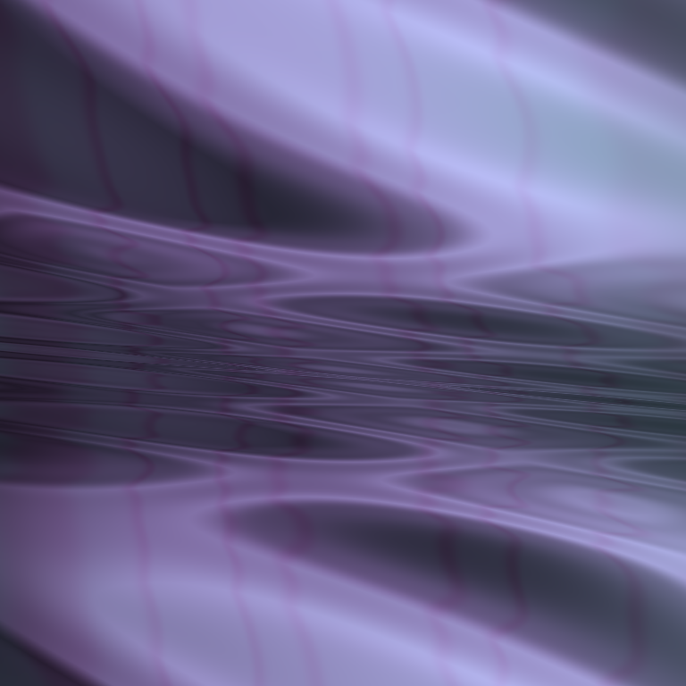

# GAS - Generative Art Synthesizer

Generative Art Synthesizer - a python program that generates python programs that generates generative art.







*Examples of images that could be generated with GAS. You can see source code of python programs that reproduce these images by clicking on them.*

## Idea

In general generative art is mostly produced by stochastic processes. If in the process of generating art piece there was no storage of initial seeds for all random processes and complete information of methods that was used to produce it, there is no way to reproduce the result again. Such possibility comes handy when you want to produce some variation of particularly good results. GAS solves this problem by applying a different approach to art generation. Instead of storing seeds and methods in some sort of artificial data format, GAS generates the entire fully deterministic program that itself produces the image. This allows complete reproducibility for generative art alongside with ease of modification for artistic control.

## Dependencies

All dependencies for running gas.py contained in requirements.txt. To set them automatically run

``` bash
pip install -r requirements.txt
```

Generated programs depend only on three packages: **numpy**, **os** and **PIL**. Exact versions of these packages indicated in the programs themselves, as well as version of python they were created on.

## How to start

To start generative session simply run

``` bash
gas.py
```

At the start of the session there will be created a run's folder with time of start of the run as its name. Inside the folder there will be created another folder called "backup" that contains the current version of project files. After that new programs will be generated and executed automatically one by one. Generated programs will create two files - the resulting image and an image of final layers that produced the result (see "Generation method" for more details). There also will be a score at the start of the name of the file that is given by a machine learning model that tries to estimate how beautiful an image is to help to sort them.

## NFT Gallery

You can see some of the most interesting images generated with GAS here:  [https://opensea.io/collection/genas](https://opensea.io/collection/genas)

If you are willing to support the project, you can acquire any NFT out of that collection. Each such NFT contains a python program that generates the image as an unlockable content.

## Generation method

In its core GAS image generation process is very similar to other math driven generative art projects where randomly generated functions are used to produce an image. However, GAS uses some strict boundaries for transformation methods, specifically - all methods always defined on [-1,1] range of values and returns only the values within that range. Also, all methods are called in a similar fashion: "x = method(x, **params)". It allows generating programs without too complicated rules that are guaranteed to always terminate. 

At the start of the generation process we have some tensor x in shape of (w, h, c) where w and h are width and height of the image we want to produce, and c is an amount of channels we have to store temporary values. We initialize this tensor with a linear combination of x and y that correspond to positions in space. After that we randomly apply methods from a predefined set of methods that transform channels one by one depending on values from other channels.

Finally we take a random number of channels and for each channel define the corresponding color, combine them into a single image and save it.

There are two core methods in use:

**Transit** - takes a batch of channels and produces a linear combination of them in a way that sum of all channels never escapes [-1,1] range.

**Sin** - takes single channel and produce $x_{out} = sin(\dfrac{1}{2}\cdot x_{in} \cdot \pi \cdot {scale} + {shift})$

Similarly to Fourier series these two methods can approximate any function that is defined within [-1, 1] range. So, theoretically, we already can generate any possible image with these two methods only, although, probability of getting any interesting result is pretty low. To battle that there are several additional methods defined.